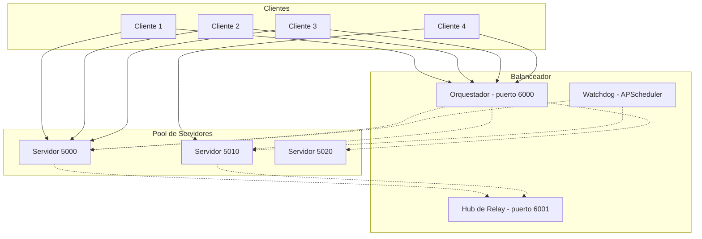
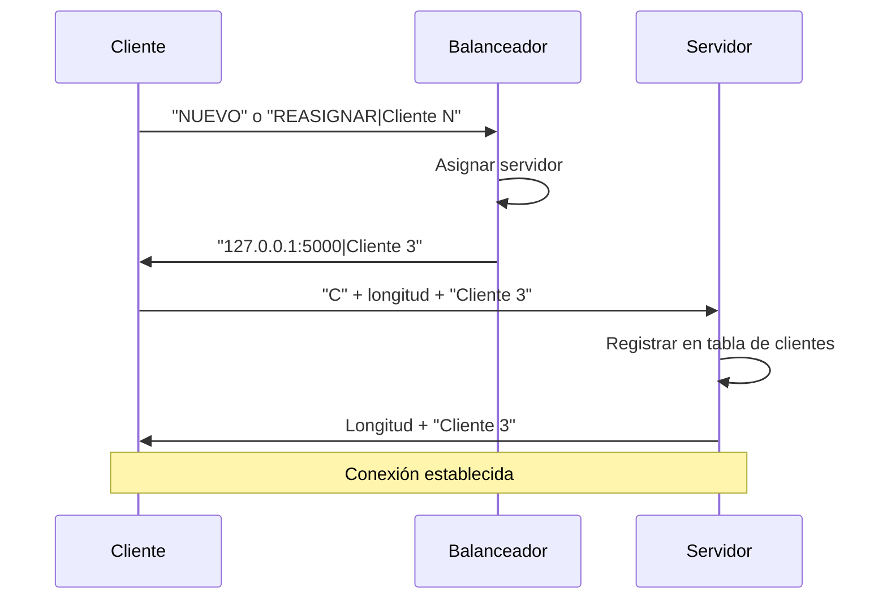
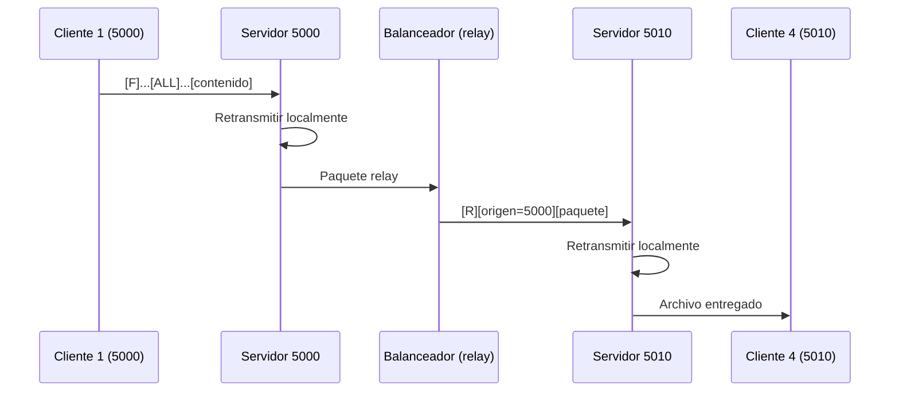

# Sistema Distribuido de Transferencia de Archivos con Balanceador de Carga

Sistema cliente-servidor para distribución de archivos con balanceo de carga,
tolerancia a fallos, escalamiento dinámico y programación de tareas mediante
APScheduler.

---

## Tabla de Contenidos

1. [Descripción General](#descripción-general)
2. [Arquitectura](#arquitectura)
3. [Requisitos](#requisitos)
4. [Instalación](#instalación)
5. [Uso](#uso)
6. [Estructura del Proyecto](#estructura-del-proyecto)
7. [Componentes](#componentes)
8. [Protocolo de Comunicación](#protocolo-de-comunicación)
9. [Configuración](#configuración)
10. [Cumplimiento de Requerimientos](#cumplimiento-de-requerimientos)
11. [Flujos Principales](#flujos-principales)
12. [Solución de Problemas](#solución-de-problemas)
13. [Decisiones de Diseño](#decisiones-de-diseño)
14. [Autores](#autores)

---

## Descripción General

Este proyecto implementa un sistema distribuido de transferencia de archivos
donde múltiples clientes pueden conectarse simultáneamente para enviar y
recibir archivos a través de servidores coordinados por un balanceador de
carga central.

### Características principales

- Balanceo de carga entre servidores disponibles
- Escalamiento dinámico según cantidad de clientes conectados
- Tolerancia a fallos con relanzamiento en el mismo puerto
- Comunicación entre servidores mediante un hub de retransmisión
- Envío de archivos en modo broadcast o a un destinatario específico
- Reconexión automática de clientes ante caídas de servidores
- Supervisión mediante tareas programadas con APScheduler
- Interfaz gráfica desarrollada con Tkinter

---

## Arquitectura

### Vista General



### Puertos del Sistema

| Componente              | Puerto        | Función                                    |
|-------------------------|---------------|--------------------------------------------|
| Balanceador (clientes)  | 6000          | Recibe consultas de asignación de clientes |
| Balanceador (relay)     | 6001          | Redistribuye archivos entre servidores     |
| Servidor inicial        | 5000          | Atiende clientes asignados                 |
| Servidores dinámicos    | 5010, 5020... | Creados al llenarse los anteriores         |

---

## Requisitos

- Python 3.8 o superior
- APScheduler
- Tkinter (incluido en la instalación estándar de Python)
- Sistema operativo: Windows, Linux o macOS

---

## Instalación

### 1. Clonar el repositorio

```bash
git clone https://github.com/nlopezr6/Detector-de-fallos-Balanceador.git
cd Detector-de-fallos-Balanceador
```

### 2. Instalar dependencias

```bash
pip install apscheduler
```

### 3. Verificar instalación

```bash
pip show apscheduler
```

---

## Uso

### Iniciar el sistema

Terminal 1 - Balanceador (lanza los servidores automáticamente):

```bash
python balanceador.py
```

Terminales adicionales - Un cliente por terminal:

```bash
python cliente.py
```

### Detener el sistema

```
Ctrl+C en la consola del balanceador
```

### Ejemplo de sesión

```
Terminal 1: python balanceador.py
Terminal 2: python cliente.py   # Cliente 1
Terminal 3: python cliente.py   # Cliente 2
Terminal 4: python cliente.py   # Cliente 3
Terminal 5: python cliente.py   # Cliente 4 - dispara creación del servidor 5010
```

### Limpieza de procesos (Windows)

Si quedan procesos activos tras una ejecución:

```powershell
taskkill /F /IM python.exe
```

---

## Estructura del Proyecto

```
Detector-de-fallos-Balanceador/
|
|-- balanceador.py         # Proceso principal (orquestador + watchdog + relay)
|-- servidor.py            # Servidor de transferencia (subproceso)
|-- cliente.py             # Cliente con interfaz gráfica
|-- config.ini             # Configuración global
|-- README.md              # Documentación
|
`-- archivos_recibidos/    # Carpeta de descargas (auto-generada)
```

---

## Componentes

### balanceador.py

Proceso principal del sistema. Es el único archivo que se ejecuta directamente.

Responsabilidades:

- Lanzar servidores como subprocesos mediante `subprocess.Popen`
- Repartir clientes entre servidores según carga
- Supervisar servidores caídos y relanzarlos
- Redistribuir archivos entre servidores mediante el hub de relay
- Programar tareas de supervisión con APScheduler

Métodos principales:

| Método                          | Descripción                                        |
|---------------------------------|----------------------------------------------------|
| `_lanzar_servidores_iniciales()`| Arranca los servidores definidos en `config.ini`   |
| `_crear_proceso_servidor()`     | Lanza un servidor como subproceso                  |
| `asignar_servidor()`            | Determina a qué servidor enviar cada cliente       |
| `_tarea_verificar_servidores()` | Job APScheduler: health check cada 2 segundos      |
| `_tarea_monitorear_conexiones()`| Job APScheduler: log de estado cada 5 segundos     |
| `_relanzar_servidor()`          | Revive un servidor caído en el mismo puerto        |
| `_servidor_relay()`             | Hub de retransmisión entre servidores              |

### servidor.py

Worker lanzado por el balanceador. No debe ejecutarse manualmente.

Responsabilidades:

- Atender clientes locales asignados
- Recibir archivos de clientes
- Retransmitir localmente (broadcast o destinatario específico)
- Enviar al relay del balanceador si el destino está en otro servidor
- Responder a health checks y consultas del balanceador

Modo pool (`--pool`):

- No ejecuta lógica de failover primario/backup
- No ejecuta heartbeats internos
- Se limita a atender clientes

### cliente.py

Interfaz gráfica del usuario. Se ejecuta una instancia por cada cliente.

Responsabilidades:

- Consultar al balanceador qué servidor le corresponde
- Conectarse al servidor asignado
- Enviar archivos (broadcast o destinatario específico)
- Recibir archivos de otros clientes
- Reconectar automáticamente si su servidor cae

---

## Protocolo de Comunicación

### Comandos

| Comando    | Dirección              | Formato                                                                |
|------------|------------------------|------------------------------------------------------------------------|
| `H`        | Balanceador → Servidor | `[H]` (health check)                                                   |
| `Q`        | Balanceador → Servidor | `[Q]` → respuesta `[4B cantidad]`                                      |
| `R`        | Balanceador → Servidor | `[R][4B origen][4B len][nombre][10B tamaño][20B destino][contenido]`   |
| `C`        | Cliente → Servidor     | `[C][2B len][nombre]`                                                  |
| `P`        | Cliente → Servidor     | `[P]` → respuesta `[PONG]`                                             |
| `F`        | Cliente → Servidor     | `[F][4B len][nombre][10B tamaño][20B destino][contenido]`              |
| `NUEVO`    | Cliente → Balanceador  | `[NUEVO]`                                                              |
| `REASIGNAR`| Cliente → Balanceador  | `[REASIGNAR\|Cliente N]`                                               |

### Formato del Paquete de Archivo

```
+----+---------+---------------+---------------+------------------+-------------+
| F  | "0012"  | "reporte.pdf" | "0000010240"  | "ALL            "| <contenido> |
| 1B |   4B    |      12B      |      10B      |       20B        |   N bytes   |
+----+---------+---------------+---------------+------------------+-------------+
```

Descripción de campos:

- `F`: identificador del comando
- `4B len`: longitud del nombre del archivo, rellenada con ceros
- `nombre`: nombre del archivo
- `10B tamaño`: tamaño en bytes, rellenado con ceros
- `20B destino`: `"ALL"` o `"Cliente N"`, rellenado con espacios
- `contenido`: bytes del archivo

---

## Configuración

### Archivo config.ini

```ini
[CLIENTE]
max_intentos = 5
tiempo_entre_intentos = 3
host = 127.0.0.1
puerto = 5000
timeout_conexion = 3
timeout_transferencia = 30
tamano_maximo_mb = 2
intervalo_ping = 3
host_balanceador = 127.0.0.1
puerto_balanceador = 6000

[SERVIDOR]
puerto_primario = 5000
puerto_backup = 5001
intervalo_heartbeat = 2
timeout_heartbeat = 5
tiempo_cesion = 3

[BALANCEADOR]
servidores_iniciales = 127.0.0.1:5000
max_clientes_por_servidor = 3
puerto_balanceador = 6000
puerto_relay = 6001
puerto_base_dinamico = 5010
intervalo_health_check = 2
timeout_health_check = 5
```

### Parámetros Principales

| Parámetro                    | Descripción                                         | Valor por defecto |
|------------------------------|-----------------------------------------------------|-------------------|
| `max_clientes_por_servidor`  | Clientes por servidor antes de crear uno nuevo      | 3                 |
| `puerto_base_dinamico`       | Puerto inicial para servidores dinámicos            | 5010              |
| `intervalo_health_check`     | Frecuencia de verificación de salud (segundos)      | 2                 |
| `timeout_health_check`       | Timeout para declarar un servidor caído             | 5                 |
| `max_intentos`               | Reintentos del cliente al reconectar                | 5                 |
| `tiempo_entre_intentos`      | Segundos entre reintentos del cliente               | 3                 |

---

## Cumplimiento de Requerimientos

| Requerimiento                                          | Estado |
|--------------------------------------------------------|:------:|
| RQ1 - Balanceador de carga con política de distribución| Cumple |
| RQ2 - Configuración inicial de servidores              | Cumple |
| RQ3 - Escalamiento automático por cantidad de clientes | Cumple |
| RQ4 - Programación de tareas con APScheduler           | Cumple |
| RQ5 - Servicio compartido entre clientes y servidores  | Cumple |
| RQ6 - Tolerancia a fallos con registro                 | Cumple |

---

## Flujos Principales

### Conexión de un Cliente



### Broadcast entre Servidores



### Recuperación ante Caída de Servidor

```
1. Watchdog detecta caída (ping cada 2 segundos)
2. Marca servidor como caído y relanzando
3. Lanza hilo de relanzamiento
4. Countdown de 10 segundos
5. Relanza el mismo servidor en el mismo puerto
6. Los clientes reconectan al servidor original
```

### Escalamiento Automático

```
Cliente nuevo se conecta y servidor actual está lleno
    |
Balanceador verifica:
    - No hay servidores vivos con espacio
    - No hay servidores pendientes de relanzamiento
    |
Crea servidor dinámico en el siguiente puerto disponible
    |
Asigna el cliente al nuevo servidor
```

---

## Solución de Problemas

### Error "Address already in use"

Causa: procesos Python anteriores permanecen activos.

Solución:

```powershell
taskkill /F /IM python.exe
```

### El cliente número N+1 no conecta

Causa: servidor dinámico aún se está inicializando.

Solución: verificar que `_crear_proceso_servidor` incluya el bucle de espera
con ping. Esperar unos segundos y reintentar.

### Se crean servidores duplicados

Causa: el watchdog y `asignar_servidor` intentan relanzar el mismo servidor
de forma concurrente.

Solución: usar `RLock` y verificar con `ping_servidor` antes de crear.

### Los archivos no llegan entre servidores

Causa: hub de relay inactivo o `aceptar_clientes` no maneja el comando `R`.

Solución: verificar que `_servidor_relay` esté corriendo y que
`aceptar_clientes` procese los comandos `H`, `Q`, `R`, `C`.

### Los nombres de cliente se incrementan

Causa: el cliente no envía su identidad al reconectar.

Solución: verificar que `consultar_balanceador` en `cliente.py` envíe
`REASIGNAR|Cliente N` cuando ya tenga un nombre asignado.

---

## Decisiones de Diseño

### Uso de subprocesos en lugar de hilos

Tkinter no permite crear múltiples instancias de `Tk()` en el mismo proceso.
Por lo tanto, cada servidor debe ser un proceso independiente.

### Relay centralizado

Un solo hub de retransmisión (en el balanceador) evita el problema de
conexiones N×N entre servidores. Cada servidor solo se comunica con el hub.

### Registro de clientes en el balanceador

El diccionario `{Cliente N: puerto}` permite que un cliente reconecte al
mismo servidor donde estaba, evitando crear servidores dinámicos
innecesarios.

### Uso de APScheduler

Reemplaza los bucles `while True` con `sleep` por tareas programadas
declarativas. Facilita agregar nuevas tareas y mejorar el manejo de errores.

### Uso de RLock en el balanceador

`RLock` es reentrante: el mismo hilo puede adquirirlo múltiples veces.
Esto evita deadlocks cuando `asignar_servidor` llama a métodos que también
necesitan el lock.

---

## Autores

Proyecto académico - Sistemas Distribuidos
Universidad Central

Desarrolladores:

- David - Balanceador y arquitectura de relay
- Duban López - Servidor y cliente

---

## Licencia

Proyecto académico de uso educativo.

---

## Referencias

- [Python socket](https://docs.python.org/3/library/socket.html)
- [Python subprocess](https://docs.python.org/3/library/subprocess.html)
- [APScheduler Documentation](https://apscheduler.readthedocs.io/)
- [Tkinter Documentation](https://docs.python.org/3/library/tkinter.html)
